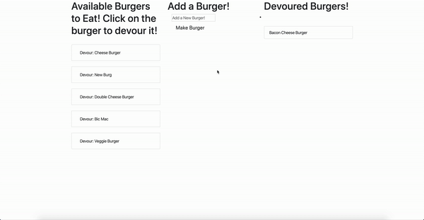

# 11-Express-Handlebars

# Description 

This is an application that utilizes a **MYSQL** database to make burgers and eat them.

# DEMO 

## Installation

* Ensure that Node and npm are installed on your computer to run this application. 

* Use the [MySQL](https://www.npmjs.com/package/mysql) NPM package to connect to your MySQL database and perform queries.

## Functionality 

* Input new burgers

* Eat burgers and move them to the devoured column 
